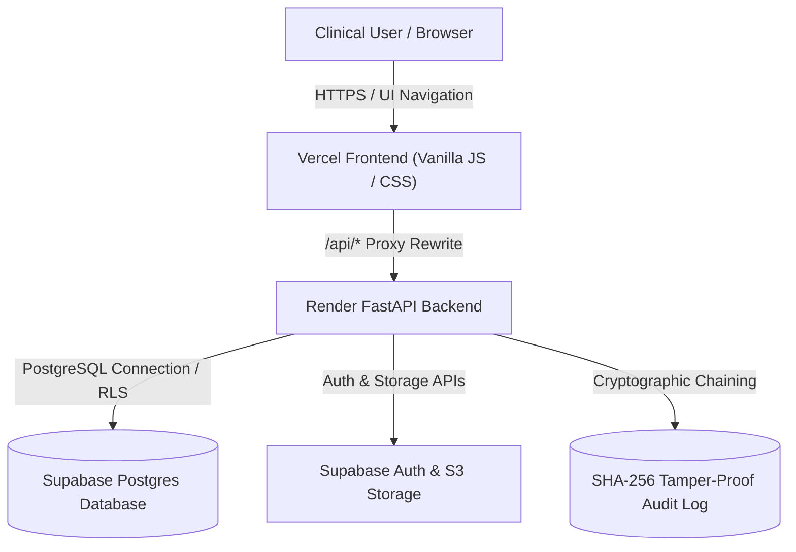
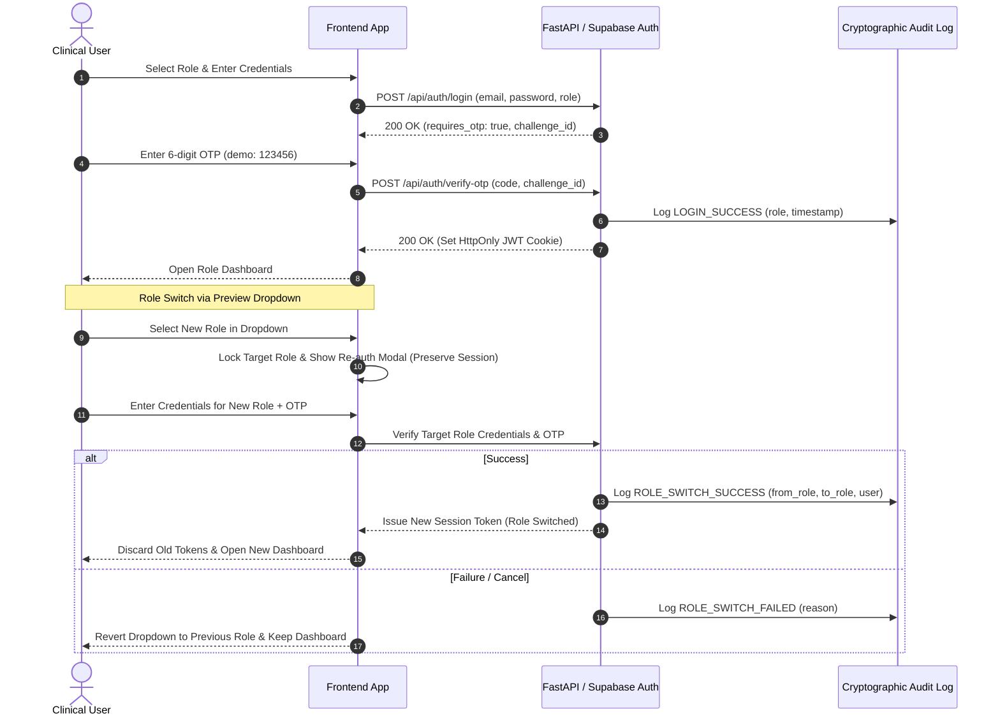
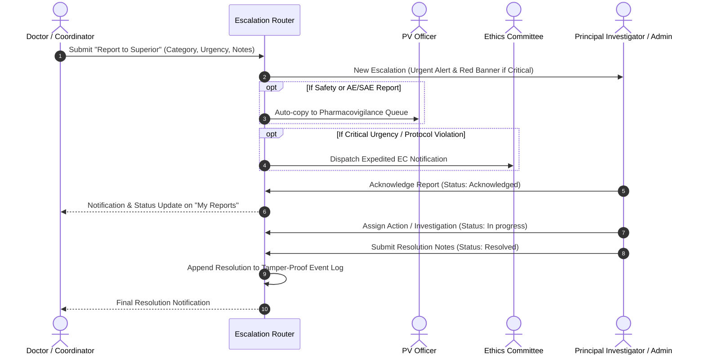
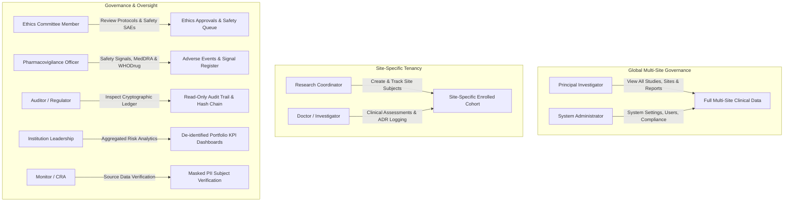
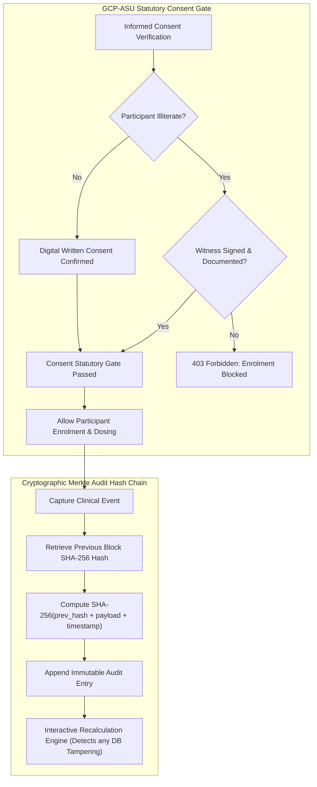
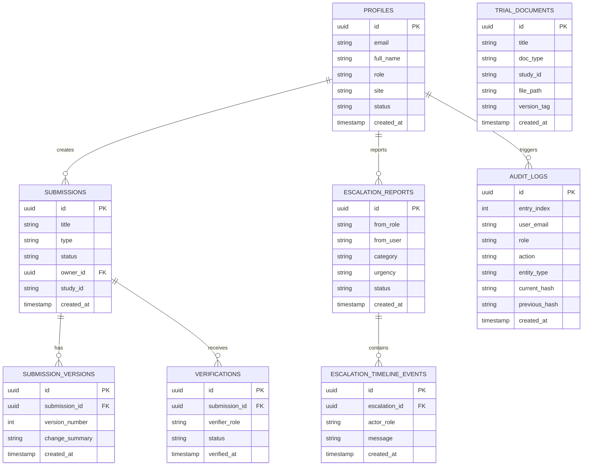
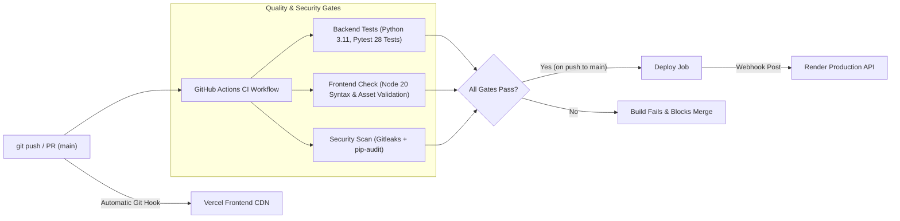

# AyurCTMS — Clinical Trial Management System for Ayurveda (AIIA)

<div align="center">
  
  <p><strong>Ministry of AYUSH | All India Institute of Ayurveda (AIIA), New Delhi</strong></p>
  <p><em>Statutory Clinical Trial Workspace engineered for Ayurveda, Siddha & Unani Research</em></p>
  <p>
    <a href="https://github.com/abishekss2007/Veda-X/actions/workflows/ci.yml"></a>
    
    
    
  </p>
</div>

---

## 1. Problem Statement

Clinical research in traditional Ayurvedic medicine faces critical compliance and operational hurdles:
- **Scattered Data Sinks**: Patient visits, Deha Prakriti assessments, and dosing logs remain dispersed across unstandardized paper records and unprotected spreadsheets.
- **Delayed Adverse Event Escalation**: Pharmacovigilance reporting often fails statutory 24-hour serious adverse event (SAE) reporting windows mandated by regulatory bodies.
- **Data Privacy Violations**: PII leakage in clinical registries conflicts with Indian data sovereignty and DPDP regulations.
- **Audit Deficiencies**: Conventional trial systems lack immutable, cryptographically verifiable audit trails to resist post-facto clinical record tampering.

---

## 2. Solution Overview

**AyurCTMS** provides an end-to-end, regulatory-grade clinical trial management system tailored for the **All India Institute of Ayurveda (AIIA)**. The platform integrates:
- **9 Tailored Role Dashboards** delivering specialized KPI workspaces for every clinical trial actor.
- **GCP-ASU Regulatory Gates** enforcing statutory informed consent rules, including mandatory independent witness verification for illiterate trial participants.
- **Hierarchical Escalation Engine ("Report to Superior")** providing instantaneous critical notifications, auto-copy to Pharmacovigilance, and expedited Ethics Committee alerts.
- **Cryptographic SHA-256 Merkle Audit Ledger** binding all clinical events into an immutable, verifiable hash chain.
- **Zero-PII Subject ID Standard** protecting all participant identities under DPDP Act 2023 guidelines.

---

## 3. Features by Role (9 Workspaces)

Every trial stakeholder accesses a dedicated, role-tailored dashboard with specialized key performance indicators and actionable clinical tools:

| Role | Core Purpose | Tailored KPIs | Primary Panels |
|---|---|---|---|
| **Principal Investigator (PI)** | Global trial oversight & site governance | Enrolment vs Target, Open SAEs, Central GCP Compliance, Unacknowledged Reports | Incoming Urgent Escalations, Multi-Site Enrolment Trend, Site Compliance Ranking, Participant Drilldown |
| **Admin** | System administration & compliance oversight | Pending User Approvals, Active Studies, System Compliance, Critical Alerts | User Approval Desk, Trial Site Configuration, CERT-In Security Desk, Immutable Audit Log |
| **Research Coordinator** | Site operations & subject tracking | Visits Due This Week, Pending Consents, Doses Scheduled Today, Active Participants | Participant Tracker, Visit Calendar, Quick Enrolment (GCP-ASU Consent Gated), Medication Dispense Log |
| **Doctor / Investigator** | Clinical assessments & ADR diagnosis | Active Cohort, ADRs Under Observation, Scheduled Clinical Visits, Open Reports | Subject Code Lookup, Prakriti & Dosha Assessment, Diagnostic Log, Flag Subject to PI, Report AE/SAE |
| **Monitor (CRA)** | Source Data Verification (SDV) & GCP monitoring | Missing Data Points, Overdue Protocol Visits, Protocol Deviations, Open Queries | Site SDV Progress Table, Protocol Deviations Register, Data Query Workflow, Monitoring Visit Report (MVR) Form |
| **Ethics Committee (EC)** | Ethical governance & participant rights | Pending Protocol Approvals, Renewals Due <30 Days, Amendments Under Review, SAEs Received | Protocol Approval Workflow, Version History, Statutory Quorum Rule Validation (≥5 members + mandatory ASU expert) |
| **Pharmacovigilance (PV) Officer** | Drug safety signals & adverse event triage | New AE/SAEs, Reports Due <24 Hours, Overdue Regulatory Reports, MedDRA Coded Events | 24h Statutory Countdown Queue, MedDRA & WHODrug Coding Drawer, Dosha Causality Assessment, DSMB Safety Signal Summary |
| **Auditor / Regulator** | Independent compliance & ledger inspection | Total Immutable Logs, Tamper Checks (0 Failed), Document Versions, Integrity Rating | SHA-256 Merkle Hash Chain Audit Ledger, Interactive "Verify Hash Chain" Engine, Regulatory Compliance Matrix |
| **Institution Leadership** | High-level portfolio oversight | Active AYUSH Studies, Total Enrolled Cohort, Serious Adverse Events, Portfolio Health Score | Multi-Trial Study Matrix, Institutional Risk Map, Phase & Budget Allocation Summaries |

---

## 4. System Architecture

AyurCTMS is built on a high-throughput, decoupled architecture combining a lightweight, responsive vanilla JavaScript frontend with a hardened FastAPI asynchronous backend and Supabase PostgreSQL services.



### Authentication & Role Switch Security Flow

Role changes within the UI require full re-authentication with mandatory step-up verification. The target role credentials must be verified on the server before a new session is granted:



---

## 5. Escalation Lifecycle ("Report to Superior")

GCP-ASU Section 3.4 mandates rapid, documented escalation of safety concerns, protocol deviations, and ethical issues to the Principal Investigator and Institutional Admin:



---

## 6. Role-Based Access Control (RBAC) Matrix

Server-side permissions strictly isolate tenant and role data. Client-side hiding is used only for usability; all route guards verify the caller's server-issued JWT token:



---

## 7. Security, Regulatory Alignment & Immutability

> **Regulatory Status Notice**: This prototype is **designed to align with GCP-ASU guidelines, DPDP Act 2023, and CERT-In directions**. It is a demonstration platform and has **not yet received formal regulatory certification or accreditation**.

### Statutory Consent Gate & Merkle Hash-Chain
Enrolment requires verified consent. In cases of illiterate trial participants, an impartial witness signature must be validated on the backend before the system allows enrolment:



---

## 8. Database Schema (Entity-Relationship Diagram)

The production Supabase PostgreSQL database enforces foreign keys, Row-Level Security (RLS), and append-only triggers:



---

## 9. Real vs Synthetic / Mocked Breakdown

| Component | Status | Details |
|---|---|---|
| **FastAPI REST Endpoints** | **REAL** | 100% functional Python endpoints covering authentication, participants, consent, escalations, ethics, and audit. |
| **Escalation & Notification Engine** | **REAL** | Real acknowledge, reply, auto-copy to PV, EC broadcast, and resolution tracking. |
| **Audit Chain & SHA-256 Merkle Verification** | **REAL** | Cryptographic hash chaining on all transactions with interactive tamper simulation. |
| **GCP-ASU Consent & Quorum Enforcement** | **REAL** | Backend rejects invalid consent attempts and enforces EC composition quorum rules. |
| **Automated Pytest Suite (28 Tests)** | **REAL** | Automated tests verifying authentication, BOLA/IDOR prevention, RLS policies, and escalations. |
| **Supabase SQL Schema & RLS Policies** | **REAL** | PostgreSQL migrations with Row-Level Security, delete prevention triggers, and versioning. |
| **Clinical Trial Participants & AEs** | **SYNTHETIC** | Demonstration datasets (6 studies, 4 sites, 150 subject codes, 60 adverse events) with zero real PII. |
| **SMS / Email OTP Verification** | **SYNTHETIC** | Demonstration code (`123456`) provided for zero-friction evaluation in prototype mode. |

---

## 10. Project Structure

```
Veda-X/
├── .github/
│   ├── dependabot.yml              # Weekly dependency updates
│   ├── pull_request_template.md    # Pull request quality & security template
│   └── workflows/
│       └── ci.yml                  # Continuous Integration & Delivery workflow
├── backend/
│   ├── app/
│   │   ├── api/                    # REST route controllers (auth, escalations, deps)
│   │   ├── core/                   # Security, middleware, audit, configuration
│   │   ├── db/                     # SQLAlchemy models and database connection
│   │   └── schemas/                # Pydantic schemas and request validators
│   ├── sql/                        # RLS policies & PostgreSQL triggers
│   ├── supabase/
│   │   └── migrations/             # 6 production SQL migration files
│   └── tests/                      # 28 Pytest automated compliance test suites
├── frontend/
│   ├── aiia-logo.jpg               # Official AIIA institute emblem
│   ├── app.js                      # Core SPA router, authentication & role controller
│   ├── chart-card.js               # Clinical data visualization components
│   ├── chart-data-helper.js        # Clinical metrics aggregator
│   ├── index.css                   # Custom responsive design system
│   ├── index.html                  # Semantic single-page application shell
│   └── vercel.json                 # Frontend deployment configuration & API rewrites
├── .env.example                    # Placeholder environment variable templates
├── pytest.ini                      # Pytest runner configuration
└── requirements.txt                # Python backend dependencies
```

---

## 11. Local Setup Guide

### Environment Variables
Configure the following variable names in your `.env` (never commit active secrets to Git):

- `DATABASE_URL`
- `SECRET_KEY`
- `ENVIRONMENT`
- `SUPABASE_URL`
- `SUPABASE_ANON_KEY`
- `SUPABASE_SECRET_KEY`
- `DEMO_MODE`
- `NEXT_PUBLIC_SUPABASE_URL`
- `NEXT_PUBLIC_SUPABASE_ANON_KEY`
- `NEXT_PUBLIC_DEMO_MODE`

### Installation & Launch

1. **Clone repository**:
   ```bash
   git clone https://github.com/abishekss2007/Veda-X.git
   cd Veda-X
   ```

2. **Backend Setup**:
   ```bash
   python -m venv env
   source env/bin/activate  # On Windows: env\Scripts\activate
   pip install -r requirements.txt
   ```

3. **Run Automated Test Suite**:
   ```bash
   python -m pytest backend/tests -v -o pythonpath=backend
   ```

4. **Start Development Server**:
   ```bash
   python -m uvicorn app.main:app --host 127.0.0.1 --port 8000
   ```
   Open `http://127.0.0.1:8000` in your browser.

---

## 12. Pre-Configured Demo Accounts

> **Demo Mode Only**: In demonstration mode, all accounts use password `Demo@2026` and OTP code `123456`.

| Role | Demo Email | Password | 2FA Verification Code |
|---|---|---|---|
| **Principal Investigator** | `pi@ayurctms.demo` | `Demo@2026` | `123456` |
| **System Administrator** | `admin@ayurctms.demo` | `Demo@2026` | `123456` |
| **Research Coordinator** | `coordinator@ayurctms.demo` | `Demo@2026` | `123456` |
| **Doctor / Investigator** | `doctor@ayurctms.demo` | `Demo@2026` | `123456` |
| **Monitor (CRA)** | `monitor@ayurctms.demo` | `Demo@2026` | `123456` |
| **Ethics Committee** | `ec@ayurctms.demo` | `Demo@2026` | `123456` |
| **Pharmacovigilance Officer** | `pv@ayurctms.demo` | `Demo@2026` | `123456` |
| **Auditor / Regulator** | `auditor@ayurctms.demo` | `Demo@2026` | `123456` |
| **Institution Leadership** | `leader@ayurctms.demo` | `Demo@2026` | `123456` |

---

## 13. CI/CD Pipeline

The automated CI/CD pipeline validates every commit and pull request on the `main` branch:



---

## 14. Cloud Deployment Architecture

- **Frontend (Vercel)**: Deployed automatically from the GitHub `main` branch with `/api/*` rewrite rules routing API calls to Render.
- **Backend (Render)**: FastAPI ASGI application running under Uvicorn with environment secrets managed via the Render Dashboard.
- **Database (Supabase)**: Managed PostgreSQL instance with Row-Level Security, storage buckets for trial documentation, and edge functions.

---

## 15. Product Roadmap

- [x] 9-Role specialized clinical workspaces with custom KPIs
- [x] Hierarchical "Report to Superior" escalation engine with SLAs
- [x] Cryptographic SHA-256 Merkle hash chain audit ledger
- [x] Re-authentication gate on role preview switching
- [ ] *[Planned]* Go-based FHIR R4 interoperability gateway
- [ ] *[Planned]* CDISC ODM / SDTM clinical data export module
- [ ] *[Planned]* Tauri desktop offline client with local encrypted SQLite cache

---

## 16. Limitations & Disclaimer

- **Prototype Demonstration Data**: All clinical studies, participant subject codes, laboratory parameters, and adverse event listings are synthetic datasets generated for demonstration purposes.
- **Non-Certified**: AyurCTMS is an academic and hackathon prototype designed to reflect GCP-ASU and DPDP principles, but has not undergone formal CDSCO or ISO 14155 certification.
- **Zero Real Patient Data**: Real patient PII must never be stored in this demonstration prototype.
